# Guide: Installing Arch Linux

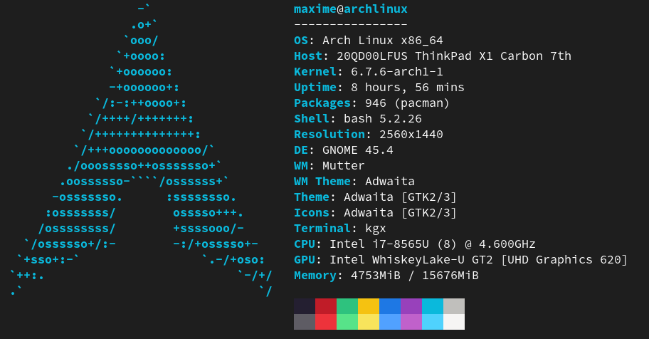

*This guide provides step-by-step instructions on how to install Arch Linux alongside Windows, using GRUB as the bootloader and KDE Plasma as the desktop environment.*

## Connect to wifi
If there is no Ethernet connection available, use the Wi-Fi instead.
```sh
# to manage wireless connections in Linux, use `iwctl` to enter the iwctl mode.
iwctl

# show device:
device list

# show network: (wlan0 is my device)
station wlan0 get-networks

# connect:
station wlan0 connect MyWifiNetwork
```
 
## Configuration to use ssh
```sh
# set password to use ssh:
passwd

# check ip address:
ip -c a
```  


 Update time date: 

```sh
timedatectl set-timezone America/New_York

timedatectl status
```

## Partitions:

 ```sh
 # Check all drive:
lsblk

# Check more information: 
fdisk -l

# Create partition: (nvme0n1 is my drive)
cfdisk /dev/nvme0n1
```

### Create 3 partitions
swap is optional

| Partition | Size  | Type              |
|-----------|-------|-------------------|
| Boot      | 10G-30G | Linux filesystem |
| Root      | Remaining Space | Linux filesystem |
| Swap      | 10G     | Linux swap        |

after creating the disk, press write and quit


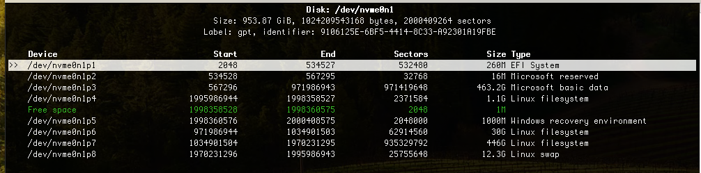

## Format 3 new partitions:

```sh
# Format Boot and Root partitions:
mkfs.ext4 /dev/nvme0n1p6
mkfs.ext4 /dev/nvme0n1p7

# Format Swap partition: 
mkswap /dev/nvme0n1p8

# Enable Swap partition:
swapon  /dev/nvme0n1p8 
```

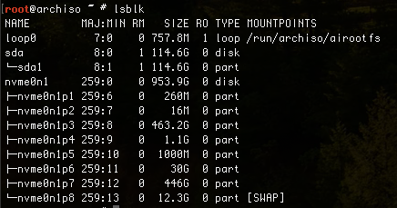

```sh
# Mount Root Partition:
mount /dev/nvme0n1p6 /mnt

# Create Dir:
mkdir /mnt/home

# Mount the home partition to this Dir:
mount /dev/nvme0n1p7 /mnt/home
```

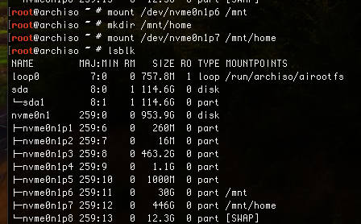


## Sync mirrors servers

```sh
# Backup best mirrors list:
 cp /etc/pacman.d/mirrorlist /etc/pacman.d/mirrorlist.bak

# backup location
 cat /etc/pacman.d/mirrorlist.bak

# Update Pacman database:
pacman -Sy

# Install packman rank mirrors tool:
pacman -S pacman-contrib   

# Save top 10 mirrors list:
rankmirrors -n 10 /etc/pacman.d/mirrorlist.bak /etc/pacman.d/mirrorlist

# Top 10 servers:
cat /etc/pacman.d/mirrorlist
```

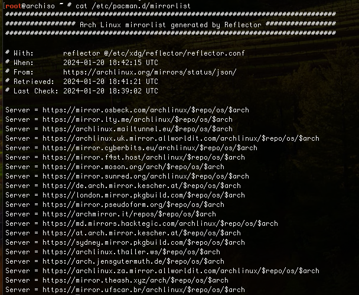

## Install Arch to Root Partition

```sh
# install system packages (add linux-lts for lts version)
pacstrap -i /mnt base base-devel linux linux-headers linux-firmware intel-ucode sudo nano vim git neofetch networkmanager dhcpcd pulseaudio wpa_supplicant

# Generate File System Table FSTAB:
genfstab -U /mnt >> /mnt/etc/fstab

# See all partitions and their mounting points:
cat /mnt/etc/fstab
```

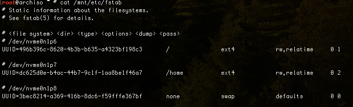

## Configure Arch

```sh
# Enter into the arch linux drive:
arch-chroot /mnt
```

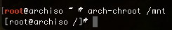

```sh
# Set root password:
passwd

# create user:
useradd -m maxime

# add password to maxime user
passwd maxime

# Add user to wheel group, allow to access root privileges:
usermod -aG wheel,storage,power maxime

```

```sh
# Edit sudo config file:
visudo

# Uncomment the first line to allow wheel group to run sudo command
# Add second line to repromp user to enter password for sudo after a timestamp
```


## Set System Language:
```sh

# Uncomment local: (en_US.UTF-8 UTF-8)
vim /etc/locale.gen

# Generate a locale:
locale-gen

# Create a conf file:
echo LANG=en_US.UTF-8 > /etc/locale.conf

# Set System language:
export LANG=en_US.UTF-8

# Sync Local time with region:
ln -sf /usr/share/zoneinfo/America/New_York /etc/localtime
```

## Hostname

```sh
# Set hostname:
echo ArchLinuxMaxime > /etc/hostname

# Read hostname
cat /etc/hostname

# Add hosts:
vim /etc/hosts
```

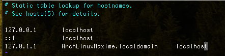

## Install Grup Bootloader:

```sh
# Install into EFI partition:
mkdir /boot/efi
mount /dev/nvme0n1p1 /boot/efi
```

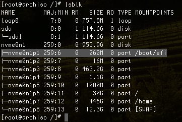

```sh
# Install grub:
pacman -S grub efibootmgr dosfstools mtools

# Uncomment this last line:
vim /etc/default/grub
```

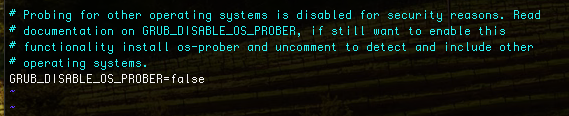

```sh
# config for dual boot
pacman -S os-prober

grub-install --target=x86_64-efi --bootloader-id=grub_uefi --recheck

grub-mkconfig -o /boot/grub/grub.cfg
```

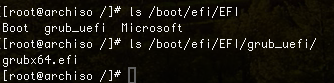

## Network Config
```sh 
# Enable Network services:
systemctl enable dhcpcd.service
systemctl enable NetworkManager.service
```

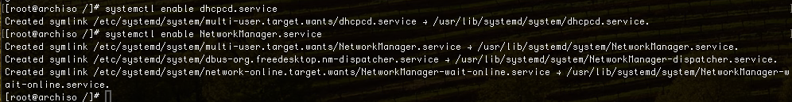

## Unmount and reboot 

```sh
# Unmount all partitions:
umount -lR /mnt

# Reboot and eject usb boot:
reboot
```

## Install KDE Plasma desktop environment 
```sh
sudo pacman -S xorg xorg-xinit xterm plasma plasma-desktop kde-applications kdeplasma-addons sddm

# Create config file to start kde on boot
sudo vim ~/.xinitrc

# Add these lines
export DESKTOP_SESSION=plasma
exec startplasma-x11

# Enable Display Manager:
sudo systemctl enable sddm.service

reboot
```

## Install GNOME desktop environment 
```sh
sudo pacman -S xorg xorg-xinit xterm gnome gnome-extra gdm

# Create config file to start kde on boot
sudo vim ~/.xinitrc

# Add these lines
export XDG_SESSION_TYPE=x11
export GDK_BACKEND=x11
exec gnome-session

# Enable Display Manager:
sudo systemctl enable gdm.service

reboot
```

## Install Nvidia driver

```sh
# find what card and drivers im using
lspci -k | grep -A 2 -E "(VGA|3D)"
```

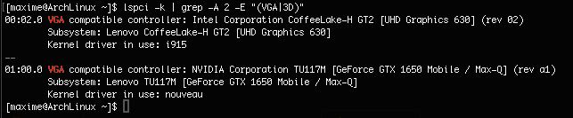

```sh
# Install Nvidia driver
sudo pacman -S nvidia
```

```sh
# remove kms from hooks to prevent nouveau driver to start on boot
sudo vim /etc/mkinitcpio.conf

sudo reboot
```
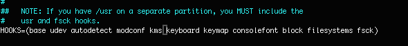

```sh
# make sure nvidia driver are being used
lspci -k | grep -A 2 -E "(VGA|3D)"
```
!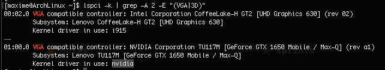